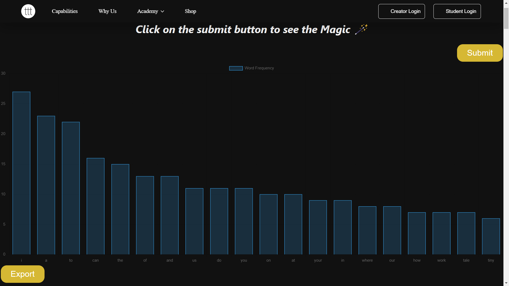

# Tiny Tales React App

The Tiny Tales React App is a web application that fetches a text file from an API, analyzes the word frequency in the text, and displays the top 20 words in a bar chart. It also provides an "Export" button to download a CSV file containing the histogram data.

## Website is being on https://tinytalesassigment.netlify.app/

## Features

- Fetches a text file from the Terribly Tiny Tales API
- Analyzes the word frequency in the text and displays the top 20 words
- Presents the word frequency data in a visually appealing bar chart
- Provides an "Export" button to download a CSV file of the histogram data

## Preview



## Getting Started
This is A Hosted single page application on github pages
Follow the instructions below to get a local copy of the project up and running on your machine.

### Prerequisites

- Node.js (version 12 or higher)
- npm (version 6 or higher) or yarn (version 1.22 or higher)
### Installation

1. Clone the repository:

   ```shell
   git clone https://github.com/lathifshaik/terriblytinytalesAssigment.git
2. Navigate to the project directory:
cd tiny-tales-react-app

3. Install the dependencies:
    ```shell
    npm install
    or
    yarn install

4. Start the development server:
    ```shell
    npm start
    or
    yarn start
Open your browser and visit http://localhost:3000 to see the app in action.
## Usage
Click the "Submit" button to fetch the text file from the Terribly Tiny Tales API.

The app will analyze the word frequency in the text and display the top 20 words in a bar chart.

Click the "Export" button to download a CSV file containing the histogram data.

## Layout Design
Layout Design is Borrowed from https://www.terriblytinytales.com/ itself 


## Technologies Used
React: JavaScript library for building user interfaces
Axios: Promise-based HTTP client for making API requests
Chart.js: JavaScript library for creating charts and graph

## ButtonComponent  features
The ButtonComponent functional component is defined, which represents the main component responsible for fetching data, parsing text, and rendering the chart.

State variables data and topWords are declared using the useState hook. data holds the fetched

## ExportButton features
The ExportButton functional component is defined, which represents the button component responsible for exporting data.

The component receives the topWords prop, which contains the top words data.

The downloadCsv function is triggered when the export button is clicked. It creates the CSV content by mapping over the topWords array and joining each word with a comma. The lines are joined with a newline character.

An anchor element (<a>) is dynamically created and appended to the document body. It is configured with the CSV content, a filename of "word_frequency.csv", and the necessary attributes for downloading.

Finally, the download is triggered by programmatically clicking the anchor element.

The component returns a <div> containing the export button, which is displayed in the center of the page.

## Acknowledgements
Terribly Tiny Tales for providing the text file API
Chart.js for the chart visualization library
## Contributing
Contributions are welcome! If you find any issues or have suggestions for improvement, feel free to open an issue or create a pull request.
